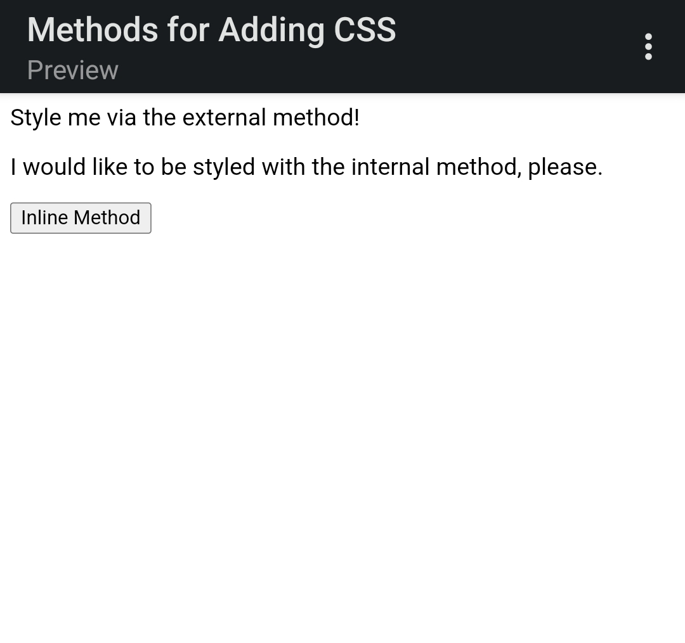

# Methods for Adding CSS
In this exercise, I'm going to practice adding CSS to an HTML file using all three methods: external CSS, internal CSS, and inline CSS. I'm only using type selectors for this exercise when adding styles via the external, internal and inline methods. I have also used keywords for colors (e.g. "blue") instead of using RGB or HEX values.

The properties added to each elements are:

* `div`: a red background, white text, a font size of 32px, center aligned, and bold
* `p`: a green background, white text, and a font size of 18px
* `button`: an orange background and a font size of 18px

## Initial

## Desired Outcome

